# ECHOPulse
This repository contains the code for the paper [**ECHOPulse: ECG Controlled Echocardiograms Video Generation**](https://arxiv.org/abs/2410.03143). Aiming to generate the ECHO video based on the ECG signal. Model weights have been released.

## :mag: Abstract

Echocardiography (ECHO) is essential for cardiac assessments, but its video quality and interpretation heavily relies on manual expertise, leading to inconsistent results from clinical and portable devices. ECHO video generation offers a solution by improving automated monitoring through synthetic data and generating high-quality videos from routine health data. However, existing models often face high computational costs, slow inference, and rely on complex conditional prompts that require expert annotations. To address these challenges, we propose **ECHOPulse**, an ECG-conditioned ECHO video generation model. ECHOPulse introduces two key advancements: (1) it accelerates ECHO video generation by leveraging VQ-VAE tokenization and masked visual token modeling for fast decoding, and (2) it conditions on readily accessible ECG signals, which are highly coherent with ECHO videos, bypassing complex conditional prompts. To the best of our knowledge, this is the first work to use time-series prompts like ECG signals for ECHO video generation. ECHOPulse not only enables controllable synthetic ECHO data generation but also provides updated cardiac function information for disease monitoring and prediction beyond ECG alone. Evaluations on three public and private datasets demonstrate state-of-the-art performance in ECHO video generation across both qualitative and quantitative measures. Additionally, ECHOPulse can be easily generalized to other modality generation tasks, such as cardiac MRI, fMRI, and 3D CT generation. 

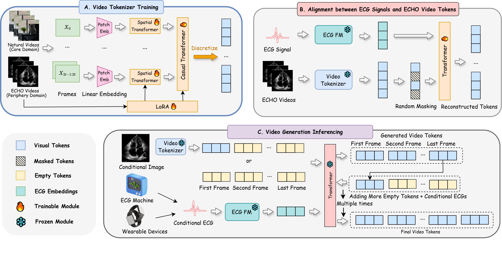

## :clapper: Visualization

We visualize each set of ECG-echodiagrams and compared them in the first row (**Prediction**) and the second row (**Ground Truth**).

| Type          | Set 1                                                        | Set 2                                                        | Set 3                                                        | Set 4                                                                                                                      | Set 5                                                                                                                      | Set 6                                                                                                                      |
| ------------- | ------------------------------------------------------------ | ------------------------------------------------------------ | ------------------------------------------------------------ | -------------------------------------------------------------------------------------------------------------------------- | -------------------------------------------------------------------------------------------------------------------------- | -------------------------------------------------------------------------------------------------------------------------- |
| Prediction    | 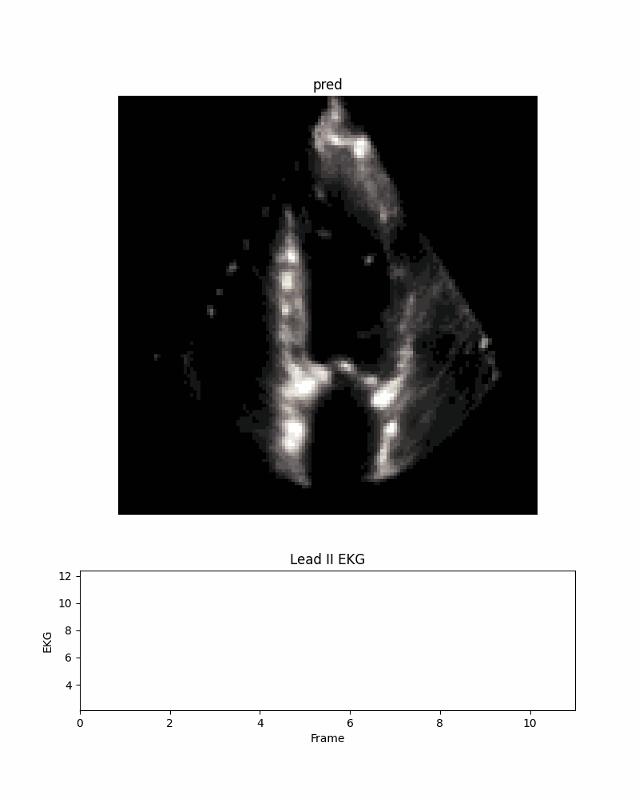   | 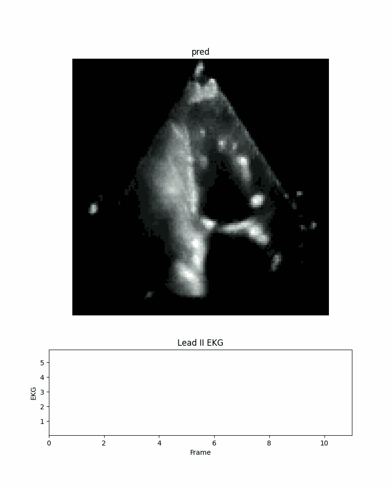   | 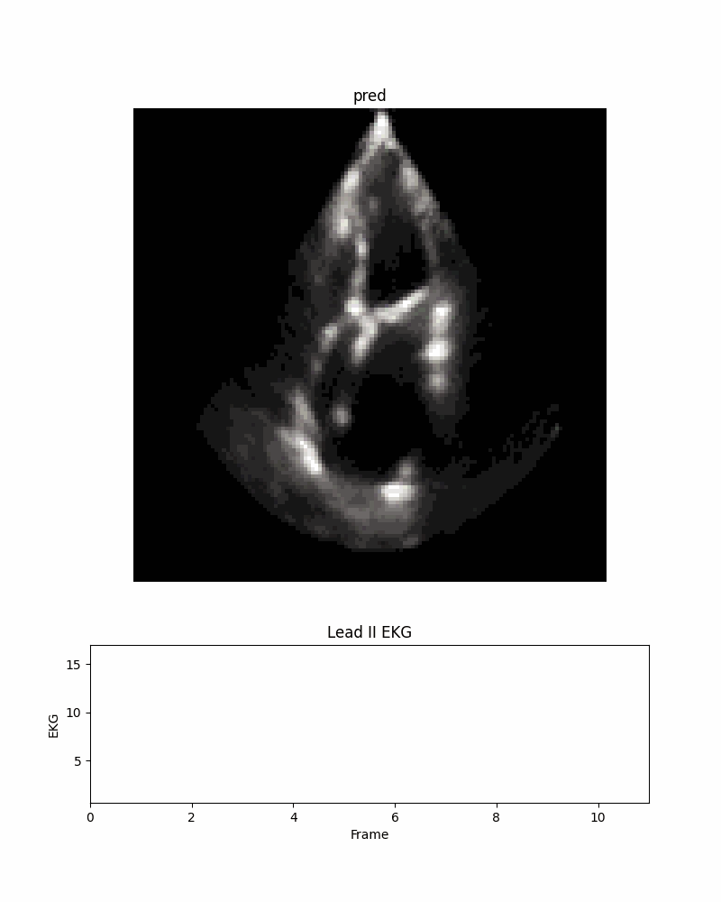  | 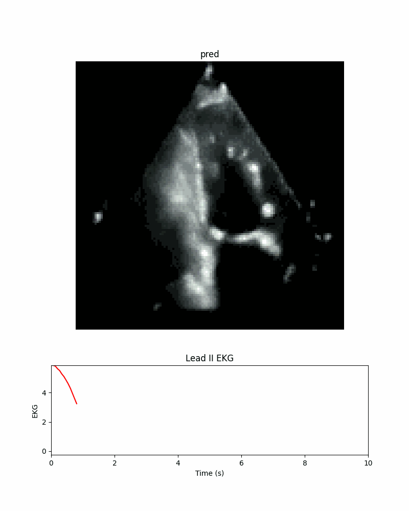          | 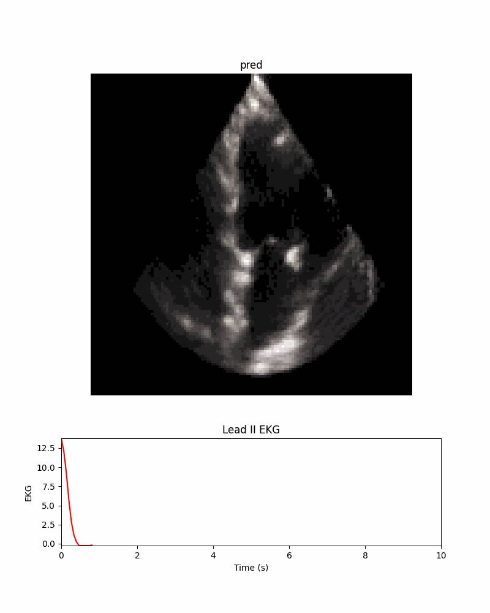            | 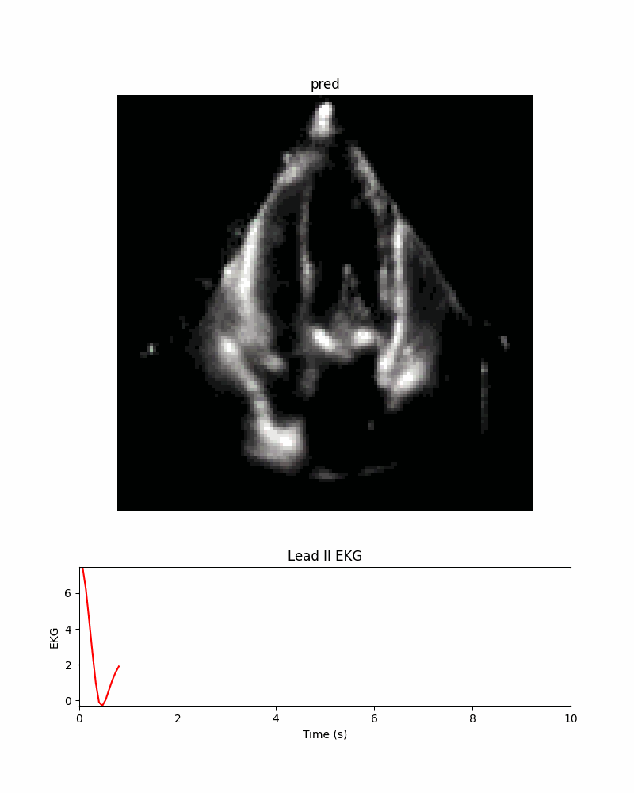         |
| Ground Truth  | 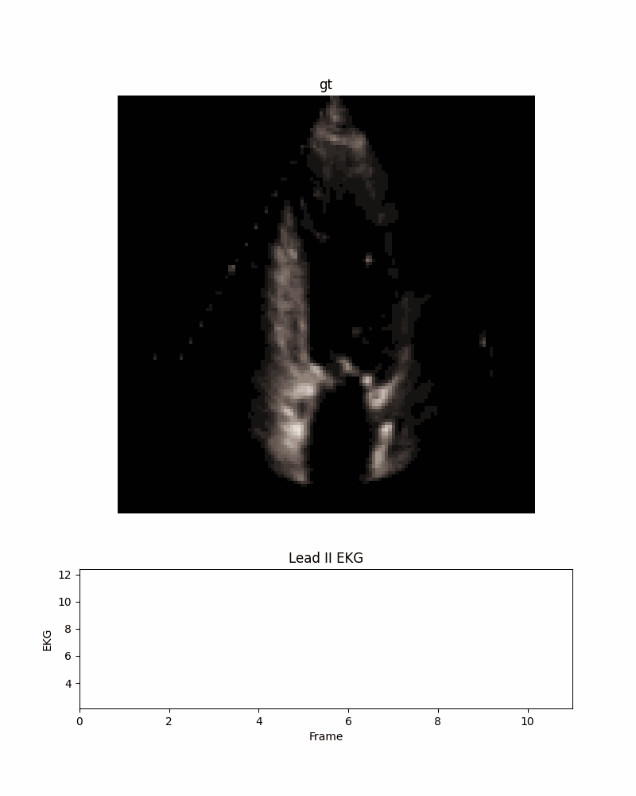        | 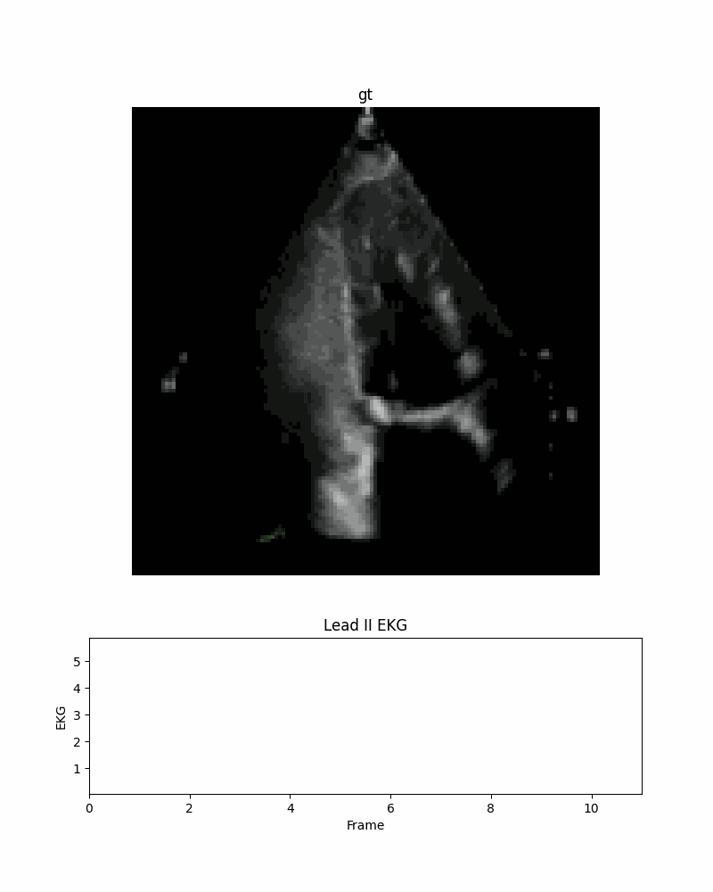        | 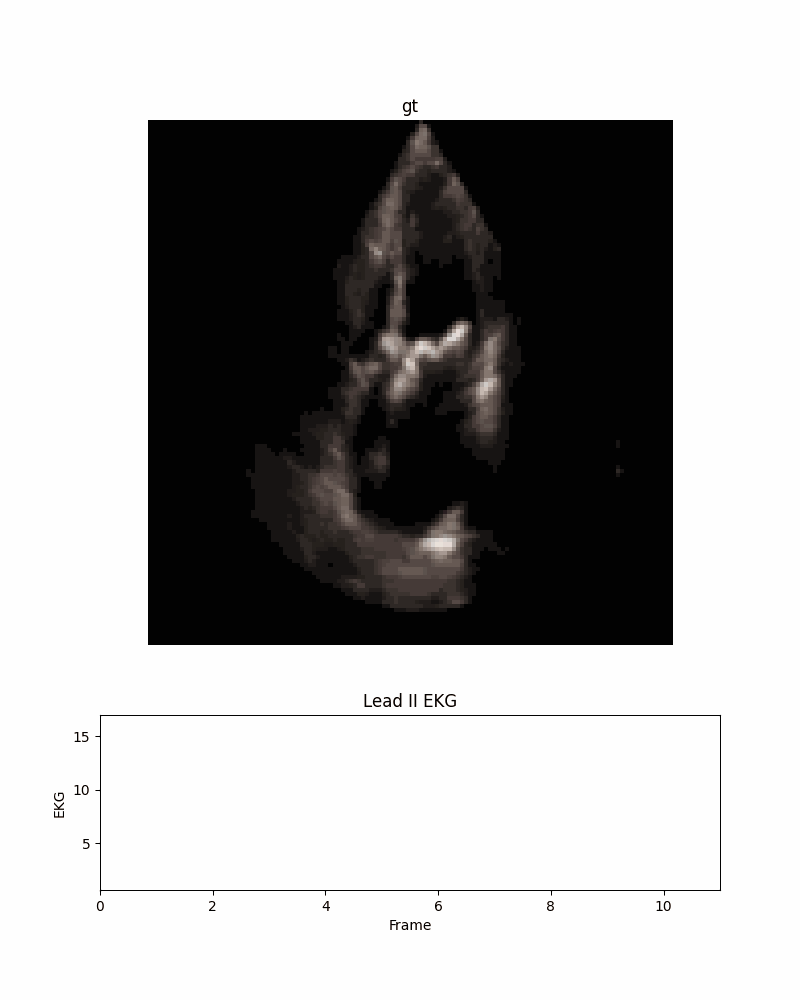       | 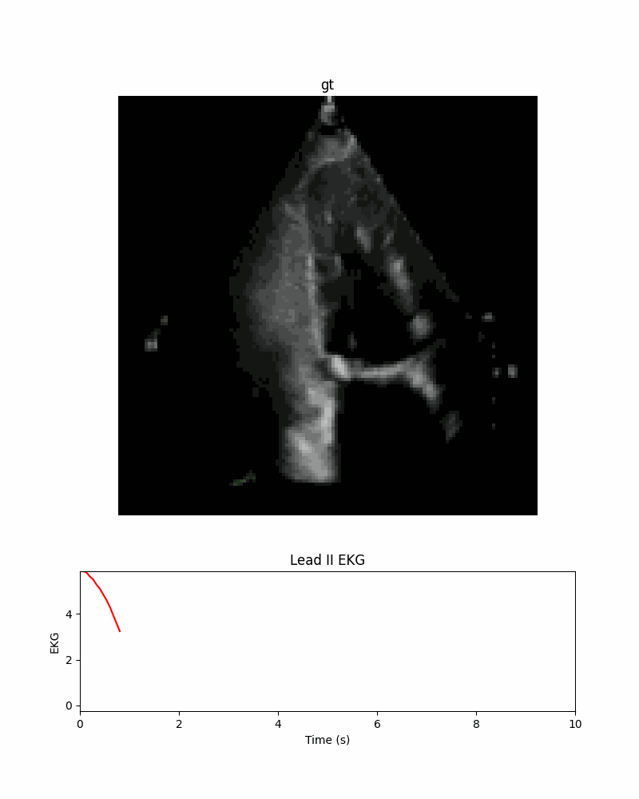              | 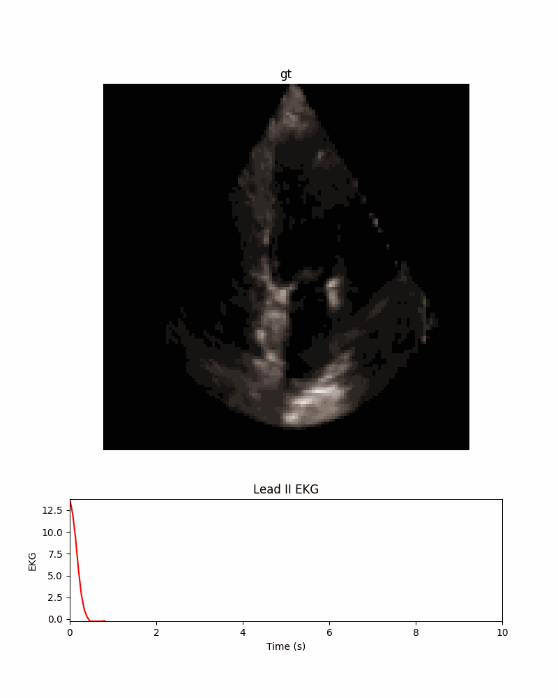                | 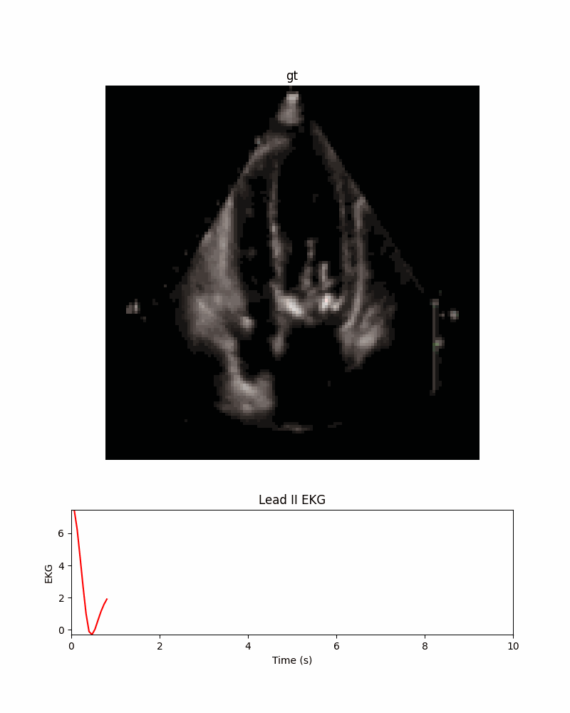             |


:sparkles: We also introduce our powerful ECHOPulse to general IoT devices (i.e., :watch: Apple Watch in this case) and obtain the following visualization.

| ECG Signal from Apple Watch v9 | Generated Echodiagram |
| --------------------------- | --------------------- 
| 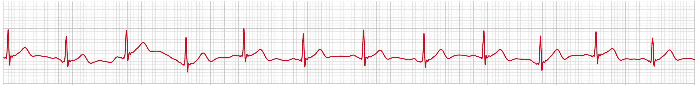 | 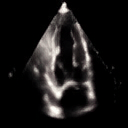 |

## :bar_chart: Results on Reconstruction Metrics  

| Methods                                   | Dataset        | MSE                      | MAE                      |
|-------------------------------------------|----------------|--------------------------|--------------------------|
| **EchoNet-Synthetic**                     | Echo-Dynamic   | $3.00 \times 10^{-3}$     | $3.00 \times 10^{-2}$     |
| **ECHOPulse (Only natural videos)**      | Echo-Dynamic   | $5.02 \times 10^{-3}$     | $4.08 \times 10^{-2}$     |
| :trophy: **ECHOPulse (Domain transfer)**          | Echo-Dynamic   | $2.89 \times 10^{-3}$     | $2.92 \times 10^{-2}$     |
| **ECHOPulse (Only natural videos)**      | Private data   | $6.09 \times 10^{-3}$     | $4.41 \times 10^{-2}$     |
| :trophy: **ECHOPulse (Domain transfer)**          | Private data   | $2.91 \times 10^{-3}$     | $2.97 \times 10^{-2}$     |

## :bar_chart: Results on Clinical EF and Time-inference Metrics

| **Methods**                           | **Condition**  | **S. time** ⬇️   | **R²** ⬆️         | **MAE** ⬇️        | **RMSE** ⬇️       | **Parameters** |
|---------------------------------------|----------------|------------------|------------------|------------------|------------------|----------------|
| [**EchoDiffusion**](https://link.springer.com/chapter/10.1007/978-3-031-43999-5_14)  | Image+EF       | Gen. 146s        | **0.89**         | 4.81             | 6.69             | 381M           |
| **ECHOPulse**                       | Image+ECG      | **Gen. 6.4s**    | 0.85             | **2.51**         | **2.86**         | 279M           |

## :bar_chart: Results on Image Quality Metrics

| Methods                                           | Dataset           | Condition            | FID↓  | A2C FVD↓ | A2C SSIM↑ | A4C FID↓ | A4C FVD↓ | A4C SSIM↑ |
|---------------------------------------------------|-------------------|----------------------|-------|----------|-----------|----------|----------|-----------|
| [**MoonShot**](https://arxiv.org/abs/2401.01827)                 | CAMUS             | Text                 | 48.44 | 202.41   | 0.63      | 61.57    | 290.08   | 0.62      |
| [**VideoComposer**](https://openreview.net/forum?id=h4r00NGkjR&nesting=2&sort=date-desc)           | CAMUS             | Text                 | 37.68 | 164.96   | 0.60      | 35.04    | 180.32   | 0.61      |
| [**HeartBeat**](https://arxiv.org/abs/2406.14098)   | CAMUS             | Text                 | 107.66| 305.12   | 0.53      | 76.46    | 381.28   | 0.53      |
| [**HeartBeat**](https://arxiv.org/abs/2406.14098)    | CAMUS             | Text&Sketch&Mask...   | 25.23 | 97.28    | 0.66      | 31.99    | 159.36   | 0.65      |
| **ECHOPLuse (Only natural videos)**               | CAMUS             | Text                 | 12.71 | 273.15   | 0.61      | 15.38    | 336.04   | 0.58      |
| **ECHOPLuse (Domain transfer)**                   | CAMUS             | Text                 | 5.65  | 211.85   | 0.79      | 8.17     | 283.32   | 0.75      |
| [**EchoDiffusion-4SCM**](https://link.springer.com/chapter/10.1007/978-3-031-43999-5_14)     | Echo-Dynamic      | Text&LVEF            | - | - | -  | 24.00    | 228.00   | 0.48      |
| [**EchoNet-Synthetic (Video Editing)**](https://arxiv.org/abs/2406.00808) | Echo-Dynamic | LVEF | - | -    |      -     | 16.90    | 87.40    |     -      |
| **ECHOPLuse (Only natural videos)**               | Echo-Dynamic      | Text                 | 36.10 | 319.25   | 0.39      | 44.21    | 334.95   | 0.35      |
| **ECHOPLuse (Domain transfer)**                   | Echo-Dynamic      | Text                 | 27.50 | 249.46   | 0.46      | 29.83    | 312.31   | 0.41      |
| [**EchoDiffusion-4SCM**](https://link.springer.com/chapter/10.1007/978-3-031-43999-5_14)     | Private data      | Text&LVEF            | 20.71 | 379.43 | 0.55  | 23.20    | 390.17   | 0.53      |
| [**EchoNet-Synthetic (Video Editing)**](https://arxiv.org/abs/2406.00808) | Private data | LVEF | 18.39 | 91.29    |      0.56     | 26.13    | 120.91    |     0.55      |
| **ECHOPLuse (Only natural videos)**               | Private data      | Text                 | 27.49 | 291.67   | 0.53      | 34.13    | 374.92   | 0.51      |
| **ECHOPLuse (Domain transfer)**                   | Private data      | Text                 | 25.44 | 224.90   | 0.54      | 31.21    | 334.09   | 0.54      |
| :2nd_place_medal: **ECHOPLuse (Only natural videos)**               | Private data      | ECG                  | 18.73 | 200.45   | 0.56      | 27.37    | 302.89   | 0.55      |
| :1st_place_medal: **ECHOPLuse (Domain transfer)**                   | Private data      | ECG                  | 15.50  | 82.44    | 0.67      | 20.82    | 107.40   | 0.66      |


## :hammer_and_wrench: Requirements

```python3
conda create -n ECHOPulse python==3.8
conda activate ECHOPulse
pip install -r requirements.txt
```

## :gear: Train & Test

### Training video tokenization model
```bash
python step1_train.py
```
### Training video generation model
```bash
python step2_train.py
```
### Pretrained model weights
[**Model Weights**](https://huggingface.co/datasets/Levi980623/ECHOTest/tree/main) should be downloaded and put into the Model_weights folder. The ECG Foundation Model used in this repo is called [**ST-MEM**](https://github.com/bakqui/ST-MEM/tree/main).

### Inference
```python3
echo_inference.ipynb
```
### Citation
If you use the code, please cite the following paper:
```
@article{li2024echopulse,
  title={ECHOPulse: ECG controlled echocardio-grams video generation},
  author={Li, Yiwei and Kim, Sekeun and Wu, Zihao and Jiang, Hanqi and Pan, Yi and Jin, Pengfei and Song, Sifan and Shi, Yucheng and Yang, Tianze and Liu, Tianming and others},
  journal={arXiv preprint arXiv:2410.03143},
  year={2024}
}
```
